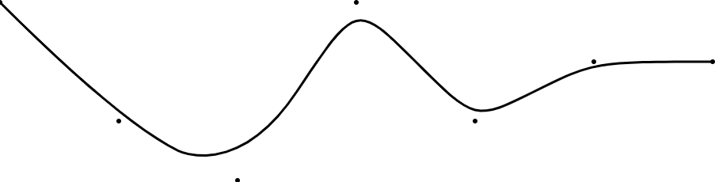

# SVG Curves

## Example

```javascript
import { createCurve } from 'svg-curves';

const points = [
  { x: 0, y: 400 },
  { x: 100, y: 500 },
  { x: 200, y: 550 },
  { x: 300, y: 400 },
  { x: 400, y: 500 },
  { x: 500, y: 450 },
  { x: 600, y: 450 },
];

const attrs = {
  stroke: 'black',
  strokeWidth: 2
};

const curve = createCurve(points, attrs);
```

## Result



[See Example](example)

## License

MIT